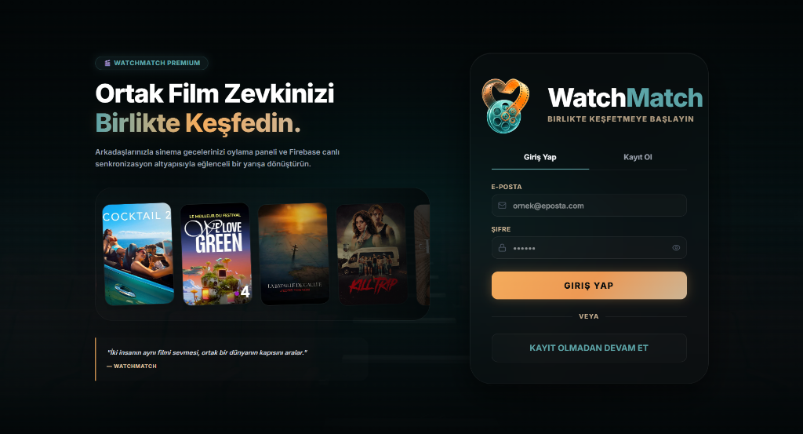
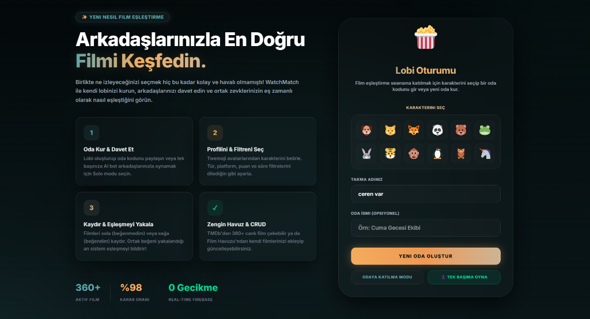
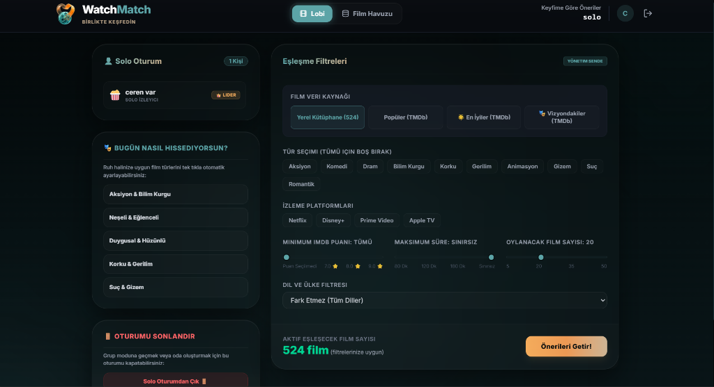
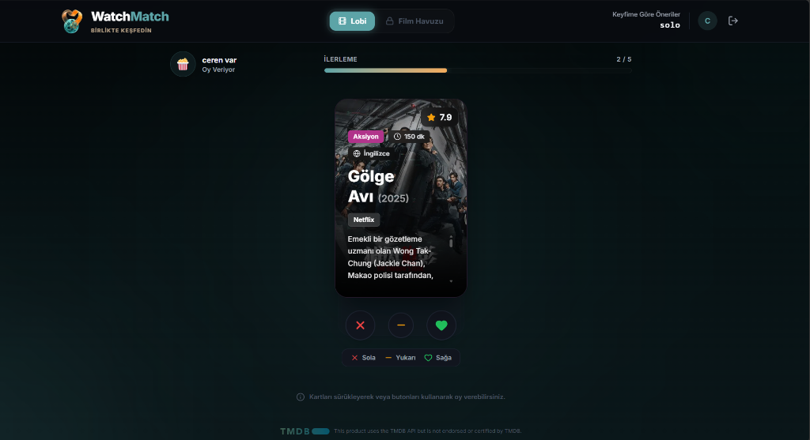
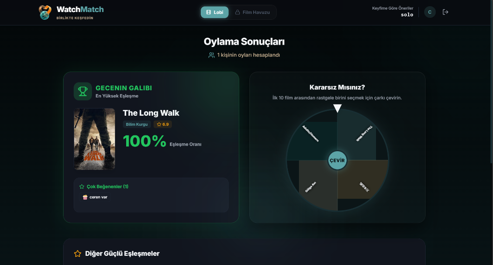

# WatchMatch 🎬

WatchMatch, arkadaşlarınızla veya tek başınıza ne izleyeceğinize karar vermenizi kolaylaştıran, eş zamanlı (real-time) çalışan modern bir film ve dizi eşleştirme platformudur. 

Proje, modern web teknolojileri temellerini pekiştirmek ve gerçekçi bir Frontend uygulaması deneyimi sunmak amacıyla geliştirilmiştir.

---

## 📸 Proje Arayüzleri (Tiffany & Altın Teması)

Uygulamanın yenilenen lüks *Glassmorphism* (Cam Morfoloji) tasarımı ve **Tiffany & Altın** renk paletiyle sunduğu arayüz kesitleri:

### 1. Sinematik Giriş & Kayıt Ekranı


### 2. Çok Oyunculu Lobi & Profil Seçimi


### 3. Gelişmiş Film Havuzu & Eşleşme Filtreleri


### 4. Oylama Arenası (Tinder-Swipe Akışı)


### 5. Canlı Sonuçlar & Karar Çarkı (MatchWheel)


---

## 🚀 Projenin Öne Çıkan Özellikleri (CRUD İşlemleri)

Projede Javascript ve ReactJS kütüphanesi kullanılarak geliştirilen **Film Havuzu (Database)** sekmesinde eksiksiz CRUD işlemleri yapılabilmektedir:

1. **Ekleme İşlemi (Create):** Kullanıcılar form aracılığıyla film adı, IMDb puanı, türü, platformları, süresi, afiş URL'si ve özetini girerek yeni filmleri kütüphaneye ekleyebilir.
2. **Listeleme İşlemi (Read/List):** Eklenen filmler ve varsayılan film havuzu modern kart tasarımları şeklinde listelenir. Arama ve platform/tür bazlı filtreleme özellikleri bulunur.
3. **Güncelleme İşlemi (Update):** Her film kartındaki düzenleme (kalem) butonu ile kayıtlı filmlerin tüm bilgileri form üzerinde güncellenebilir.
4. **Silme İşlemi (Delete):** Silme (çöp kutusu) butonu yardımıyla filmler kütüphaneden güvenli bir şekilde silinebilir.

---

## 🛠️ Kullanılan Teknolojiler ve Sürümler

Uygulama, modern Frontend ekosistemine uygun olarak aşağıdaki kütüphane ve teknolojiler ile geliştirilmiştir:

- **Çekirdek Çerçeve (Core Framework):** ReactJS (v19.2.7) & Vite (v8.1.1)
- **Stil Tasarımı (CSS):** Tailwind CSS v4 (@tailwindcss/postcss v4.3.3)
- **Veri Depolama & Eşleşme (Realtime Database):** Firebase SDK (v12.16.0) (Oda senkronizasyonu ve lobi sistemi için)
- **Animasyonlar:** Framer Motion (v12.42.2) (Akıcı swipe ve geçiş efektleri için)
- **İkon Seti:** Lucide React (v1.25.0)

---

## 📂 Dosya ve Dizin Yapısı

Proje dosyaları, modüler ve sürdürülebilir bir geliştirme yapısı sunacak şekilde organize edilmiştir:

- `/src/components`: Tekrar kullanılabilir arayüz bileşenleri (MovieForm, MovieCard, Header vb.)
- `/src/pages`: Sayfa seviyesindeki bileşenler (Database, Lobby, SwipeArena, Results, Auth)
- `/src/interfaces`: Veri modelleri ve şemaların açıklandığı klasör
- `/src/hooks`: Çok oyunculu senkronizasyon mantığını içeren özel kancalar (useRoomSync)
- `/src/lib`: Firebase istemci yapılandırması
- `/src/data`: Varsayılan başlangıç film listeleri

---

## 🏃‍♂️ Çalıştırma Adımları

Projeyi yerel bilgisayarınızda çalıştırmak için aşağıdaki adımları sırasıyla takip ediniz:

### 1. Depoyu (Repository) Klonlayın veya İndirin
Projeyi bilgisayarınıza indirdikten sonra terminalde proje dizinine geçiş yapın:
```bash
cd film-match-list
```

### 2. Bağımlılıkları Yükleyin
Gerekli paketleri kurmak için npm paket yöneticisini kullanın:
```bash
npm install
```

### 3. Çevre Değişkenlerini Tanımlayın (.env)
Proje kök dizininde `.env` adında bir dosya oluşturun ve Firebase ile TMDb API anahtarlarınızı aşağıdaki formatta ekleyin:
```env
VITE_TMDB_API_KEY=YOUR_TMDB_API_KEY
VITE_FIREBASE_API_KEY=YOUR_FIREBASE_API_KEY
VITE_FIREBASE_AUTH_DOMAIN=YOUR_FIREBASE_AUTH_DOMAIN
VITE_FIREBASE_PROJECT_ID=YOUR_FIREBASE_PROJECT_ID
VITE_FIREBASE_STORAGE_BUCKET=YOUR_FIREBASE_STORAGE_BUCKET
VITE_FIREBASE_MESSAGING_SENDER_ID=YOUR_FIREBASE_MESSAGING_SENDER_ID
VITE_FIREBASE_APP_ID=YOUR_FIREBASE_APP_ID
VITE_FIREBASE_MEASUREMENT_ID=YOUR_FIREBASE_MEASUREMENT_ID
```

### 4. Yerel Sunucuyu Başlatın
Geliştirme sunucusunu ayağa kaldırmak için:
```bash
npm run dev
```
Tarayıcınızda `http://localhost:5173/` adresine giderek uygulamayı görüntüleyebilirsiniz. Giriş ekranında hızlıca test edebilmek için **"Kayıt Olmadan Devam Et" (Anonim Giriş)** seçeneğini seçebilirsiniz.

### 5. Projeyi Derleyin (Build)
Production (canlı ortam) derlemesi almak için:
```bash
npm run build
```
